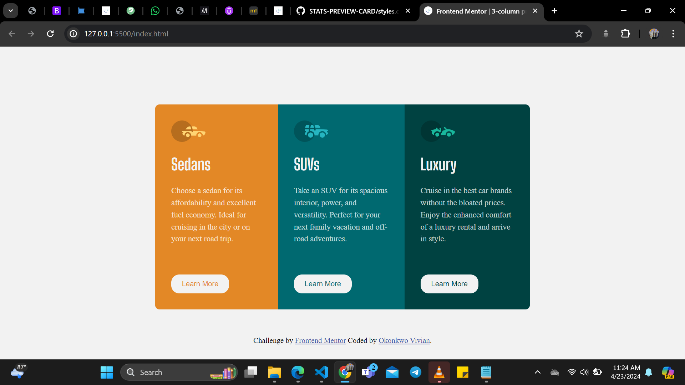

# Frontend Mentor - Order summary card solution

This is a solution to the [Order summary card challenge on Frontend Mentor](https://www.frontendmentor.io/challenges/order-summary-component-QlPmajDUj). Frontend Mentor challenges help you improve your coding skills by building realistic projects. 

## Table of contents

- [Overview](#overview)
  - [The challenge](#the-challenge)
  - [Screenshot](#screenshot)
  - [Links](#links)
- [My process](#my-process)
  - [Built with](#built-with)
  - [What I learned](#what-i-learned)
  - [Continued development](#continued-development)
  - [Useful resources](#useful-resources)
- [Author](#author)


## Overview

### The challenge

Users should be able to:

- See hover states for interactive elements

### Screenshot



### Links

- Solution URL: https://github.com/vivi-uch/3-column-preview-cards
- Live Site URL: https://vivi-uch.github.io/3-column-preview-cards/

## My process

### Built with

- Semantic HTML5 markup
- CSS custom properties
- Flexbox
- CSS Grid
- @media

### What I learned

```css
.container{
    overflow: hidden; /* Ensure content doesn't overflow rounded corners */
}
button{
    cursor: pointer;
}
/* USING @media */
@media (max-width/min-width: size in width){
  /* contents */
}

```

### Useful resources

- [Frontend Mentor](https://www.frontendmentor.io/home)
- [Udemy Angela Yu Web dev course](https://www.udemy.com/course/the-complete-web-development-bootcamp/)
- [ChatGPT](https://chat.openai.com/) 
- [W3school](https://www.w3schools.com/) 

## Author

- Linkeldn - [vivian okonkwo](https://www.linkedin.com/in/vivian-okonkwo-24b228253/)
- Frontend Mentor - [@okonks](https://www.frontendmentor.io/profile/okonks)
